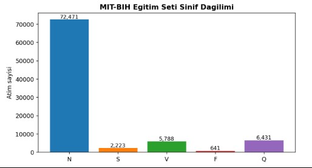
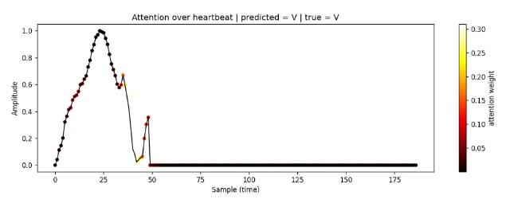

# ECG Aritmi Sınıflandırma & 1D-GAN Sentezi
### CNN · CNN+LSTM · CNN+LSTM+Attention · 1D-LSTM GAN (PyTorch)

MIT-BIH ve PTBDB veri setleri üzerinde EKG kalp atımlarını AAMI standardına göre
5 sınıfta sınıflandıran ve sınıf dengesizliğini **1D-GAN ile üretilen sentetik
atımlarla** kapatan, modüler bir PyTorch projesi. Ensemble model test setinde
**%98.0 accuracy** ve tüm sınıflarda **recall ≥ %88** elde eder.

---

## 🩺 Tıbbi Arka Plan / Medical Background

Veri setindeki her satır, R-tepesine hizalanmış ve sabit **187 örneğe** normalize
edilmiş **tek bir kalp atımıdır**. Her atım bir **PQRST kompleksi** içerir: P dalgası
(atriyal depolarizasyon), QRS kompleksi (ventriküler depolarizasyon — en keskin
bileşen) ve T dalgası (repolarizasyon).

**Sınıflar (AAMI):**

| ID | Kod | Açıklama |
|----|-----|----------|
| 0 | N | Normal beat (+ dal blokları / bundle branch blocks) |
| 1 | S | Supraventricular ectopic (örn. atriyal prematüre) |
| 2 | V | Ventricular ectopic (PVC) |
| 3 | F | Fusion beat |
| 4 | Q | Unknown / Paced |

---

## ⚠️ Problem: Aşırı Sınıf Dengesizliği

Normal (N) atımlar eğitim setinin **~%82**'sini oluşturur (72.471 / 87.554);
en nadir sınıf **F yalnızca 641 atım (%0.7)**. Dengesiz veriyle eğitilen model
yüksek *accuracy* alır ama kritik aritmileri kaçırır (yüksek false-negative).
Bu yüzden **macro-F1 ve recall (sensitivity)** önceliklendirilir.



---

## 🏗️ Mimari: İki Fazlı Boru Hattı / Two-Phase Pipeline

```
            ┌─────────────────────────────────────────┐
 FAZ 1      │  Her azınlık sınıfı için 1D-LSTM GAN     │
 (GAN)      │  S, V, F, Q → sentetik gerçekçi atımlar  │
            └───────────────────┬─────────────────────┘
                                │ sentetik atımlar
                                ▼
            ┌─────────────────────────────────────────┐
 Veri       │  Sızıntısız bölme → dengeleme (resample) │
            │  + sentetik atımlar + Gaussian noise     │
            └───────────────────┬─────────────────────┘
                                ▼
            ┌─────────────────────────────────────────┐
 FAZ 2      │  CNN ──┐                                 │
 (Sınıf-    │  CNN+LSTM ──┼──→ ENSEMBLE (soft voting)  │
  landırma) │  CNN+LSTM+Attention ──┘                  │
            └─────────────────────────────────────────┘
```

- **CNN** — lokal morfolojiyi, özellikle keskin **QRS kompleksini** yakalar.
- **CNN+LSTM** — atımlar arası **ritim/zamansal bağımlılığı** modeller (bidirectional).
- **CNN+LSTM+Attention** — dizinin hangi bölümünün (genelde **R-peak/QRS**) tanıya
  en çok katkı verdiğini öğrenir → hem doğruluk hem **yorumlanabilirlik**.

---

## 📁 Proje Yapısı / Project Structure

```
.
├── data/                  # MIT-BIH & PTBDB CSV'leri (repoda yok, ayrıca indirilir)
├── data_loader.py         # CSV okuma, dengeleme, augmentation, Dataset/DataLoader
├── models.py              # CNN, CNNLSTM, CNNLSTMAttention, Generator, Discriminator
├── evaluate.py            # Meter, confusion matrix, precision/recall/F1, attention viz
├── train.py               # GAN + sınıflandırıcı eğitimini koordine eden ana dosya
├── requirements.txt
└── README.md
```

---

## ⚙️ Kurulum / Setup

```bash
pip install -r requirements.txt
```

**Veri kurulumu:** MIT-BIH ve PTBDB CSV'leri repoya dahil değildir (boyut).
PhysioNet / Kaggle "Heartbeat" dağıtımından indirip `data/` klasörüne koyun:
```
data/mitbih_train.csv, data/mitbih_test.csv,
data/ptbdb_normal.csv, data/ptbdb_abnormal.csv
```

---

## 🚀 Kullanım / Usage

```bash
# Hızlı doğrulama (GAN atlanır, ~15-30 dk)
python train.py --no-gan --clf-epochs 10

# Tam boru hattı (GAN dahil, ~1.5-2.5 saat, GPU şart)
python train.py --gan-epochs 1500 --clf-epochs 25
```

| Argüman | Varsayılan | Açıklama |
|---------|-----------|----------|
| `--no-gan` | kapalı | GAN augmentation'ı atla |
| `--gan-epochs` | 3000 | GAN eğitim epoch sayısı |
| `--clf-epochs` | 30 | Sınıflandırıcı epoch sayısı |

---

## 🧠 Modeller / Models

| Model | Yapı | Öne çıkan özellik |
|-------|------|-------------------|
| `CNN` | 3× ConvNormPool (skip-connection) + GAP | Lokal morfoloji / QRS |
| `CNNLSTM` | CNN + BiLSTM + temporal pooling | Ritim & zamansal bağlam |
| `CNNLSTMAttention` | CNN + BiLSTM + additive attention | Yorumlanabilir odak |
| `Generator` / `Discriminator` | 1D-LSTM GAN | Sentetik azınlık atımı |

`ConvNormPool`: nedensel (causal) padding + artık (residual) bağlantı + Swish +
MaxPool. Sınıflandırıcılar **logit** döndürür (çift-softmax hatası giderildi).

---

## 📊 Değerlendirme Metrikleri / Evaluation

Dengesiz veride **accuracy tek başına yanıltıcıdır**:
- **Recall (Sensitivity):** Gerçek aritmilerin kaçı yakalandı? *(en kritik)*
- **Precision (PPV):** Aritmi denenlerin kaçı doğru?
- **Macro-F1:** Sınıf bazında eşit ağırlık → azınlık sınıflar görünür.

---

## 📈 Sonuçlar / Results (MIT-BIH Test, 21.892 atım)

**Final performans — GAN augmentation ile:**

| Model | Accuracy | Macro-F1 | Macro-Recall |
|-------|:--------:|:--------:|:------------:|
| CNN | 97.72% | 87.72% | 94.17% |
| CNN+LSTM | 97.66% | 88.31% | 94.25% |
| CNN+LSTM+Attention | 97.67% | 88.00% | 93.92% |
| **Ensemble (soft voting)** | **98.01%** | **88.95%** | **94.06%** |

**Ensemble — sınıf bazlı:**

| Sınıf | Precision | Recall | F1-score | Support |
|-------|:---------:|:------:|:--------:|:-------:|
| N | 99.48% | 98.40% | 98.94% | 18.118 |
| S | 76.45% | 87.59% | 81.64% | 556 |
| V | 95.17% | 96.62% | 95.89% | 1.448 |
| F | 56.52% | 88.27% | 68.92% | 162 |
| Q | 99.32% | 99.44% | 99.38% | 1.608 |


**GAN augmentation etkisi (ablation, Ensemble):**

| Yapılandırma | Accuracy | Macro-F1 | S-Precision | F-Precision |
|--------------|:--------:|:--------:|:-----------:|:-----------:|
| GAN'siz (resample) | 97.43% | 87.15% | 66.89% | 51.75% |
| **GAN'li** | **98.01%** | **88.95%** | **76.45%** | **56.52%** |

GAN sentetik verisi, hedeflenen en nadir sınıfların precision'ını belirgin artırdı
(**S +9.6 puan, F +4.8 puan**). Tüm sınıflarda recall ≥ %88.

---

## 🔍 Yorumlanabilirlik / Interpretability

Attention ağırlıkları LSTM zaman adımlarından sinyalin 187 örneğine geri ölçeklenip
EKG'nin üstüne bindirilir. Modelin dikkati bir V (ventriküler) atımında
**R-peak/QRS yükselişine** yoğunlaşmış, düz/sıfır bölgeye hiç bakmamıştır — yani
model kararını klinik olarak anlamlı bir bölgeye dayandırır (kara kutu değil).



---

## 🧬 GAN: Gerçek vs. Sentetik

1D-LSTM GAN her azınlık sınıf için ayrı eğitilir ve sentetik atımlar üretir; her
sınıfın çekirdek morfolojisini (R-peak, dalga şekli, zero-padding) sınıfa-özel
öğrenir. **Bilinen sınırlama:** Discriminator bazı sınıflarda (V, Q) baskın geldiği
için sentetik atımlar gerçeklere göre **daha az çeşitlidir (kısmi mode collapse)**.

---

## 📝 Tasarım Notları / Design Decisions

1. **Sızıntısız bölme:** Validation ham train'den ayrılır; dengeleme & sentetik
   yalnızca eğitime eklenir → data leakage engellenir.
2. **GAN > basit upsample:** Kopyalamak ezberi körükler; GAN çeşitli sentetik
   örnek üretip genellemeyi destekler.
3. **Logit çıktısı:** Modeller softmax uygulamaz; `CrossEntropyLoss` ile uyumlu.
4. **Yorumlanabilir attention:** Additive attention, sinyale bindirilebilir dağılım.
5. **Augmentation hijyeni:** Gauss gürültüsü yalnızca eğitimde; test/val'a asla.

---

## 🔭 Gelecek İş / Future Work

- Çok-lead (multi-lead) sinyal ve hasta-bazlı (inter-patient) bölme.
- GAN çeşitliliği için **WGAN-GP**, **conditional GAN**, label smoothing.
- Sentetik verinin klinik geçerliliğinin kardiyolog onayından geçirilmesi.

---

## 🗂️ Veri Setleri

- **MIT-BIH Arrhythmia** — 5 sınıflı atım sınıflandırması (ana görev).
- **PTBDB** — ikili (normal vs. miyokard enfarktüsü) sinyaller (opsiyonel).

Kaynak: PhysioNet (Kaggle "Heartbeat" dağıtımı).
